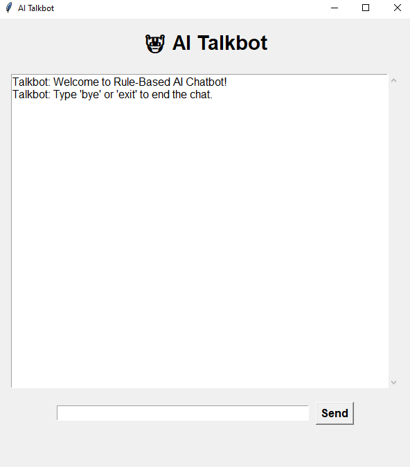
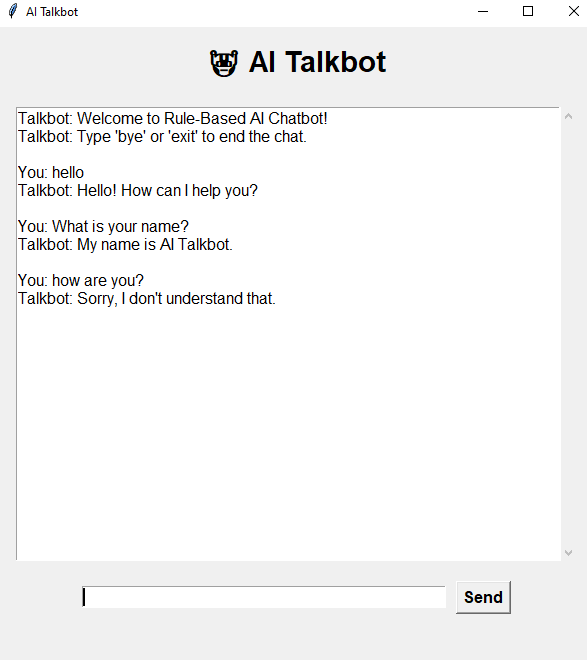

#  AI Chatbot

A simple **Rule-Based AI Chatbot** developed using Python.
The chatbot can understand basic user inputs, respond to common greetings, and end the conversation when the user enters an exit command.

##  Features

* Handles common greetings such as `hello`, `hi`, and `hey`
* Provides simple rule-based responses
* Supports exit commands such as `bye` and `exit`
* Easy-to-understand Python implementation
* Beginner-friendly AI chatbot project
* Can be extended with more commands and responses

##  Technologies Used

* **Python**
* **Rule-Based Logic**
* **VS Code**

##  Project Structure

```text
AI-Chatbot/
│
├── app.py
├── README.md
└── screenshots/
    ├── screenshot1.jpg
    ├── screenshot2.jpg
```

## How to Run

1. Clone or download this repository.
2. Open the project folder in VS Code.
3. Open the terminal.
4. Run:

```bash
python app.py
```

5. Start chatting with the chatbot.

##  Example

```text
Welcome to Rule-Based AI Chatbot
Type 'bye' or 'exit' to end the chat.

You: hello
Bot: Hello! How can I help you?

You: bye
Bot: Goodbye! Have a nice day!
```

##  Screenshots

### Chatbot Running



### Chatbot Conversation



## Future Improvements

* Add more conversational responses
* Add a graphical user interface (GUI)
* Add voice input and output
* Integrate Natural Language Processing (NLP)
* Improve chatbot intelligence

##  Author

**Aima Sadeer**

GitHub: [Aima-Sadeer](https://github.com/Aima-Sadeer)


