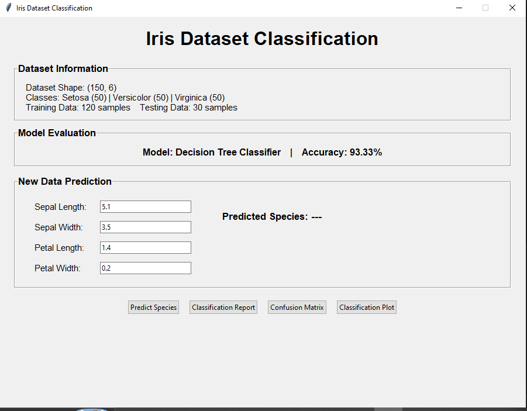
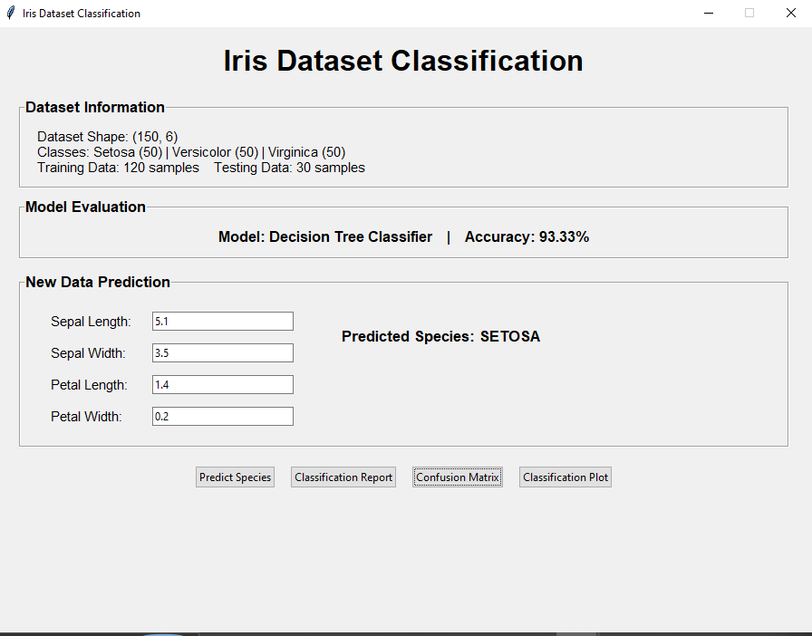
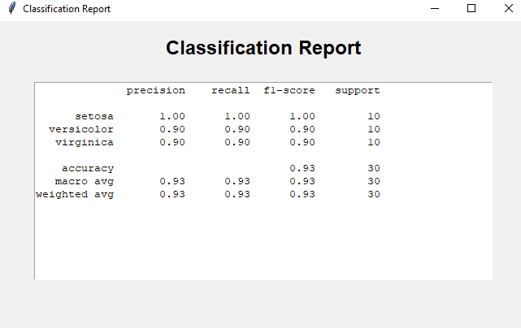
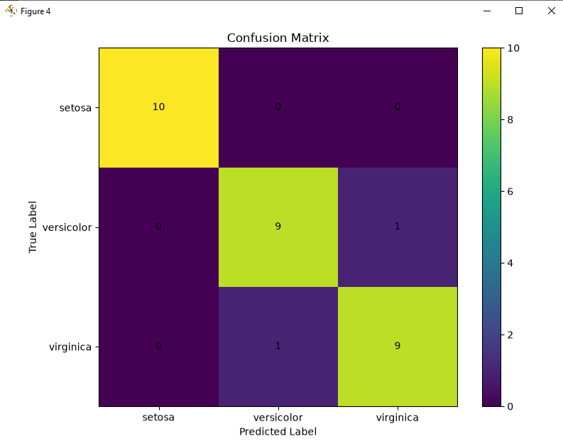
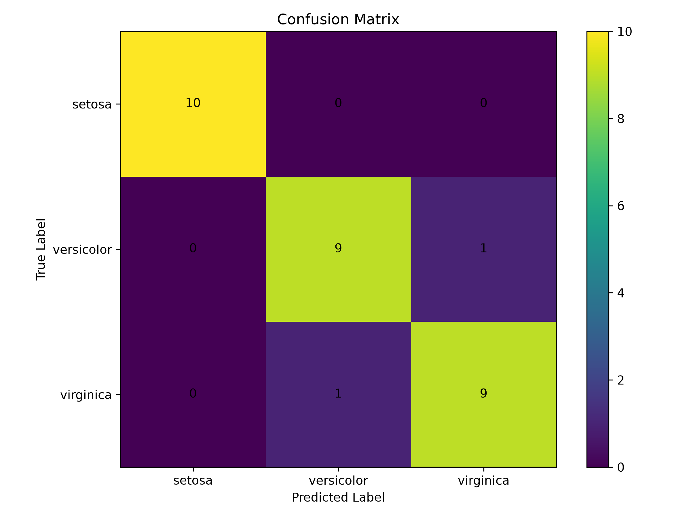
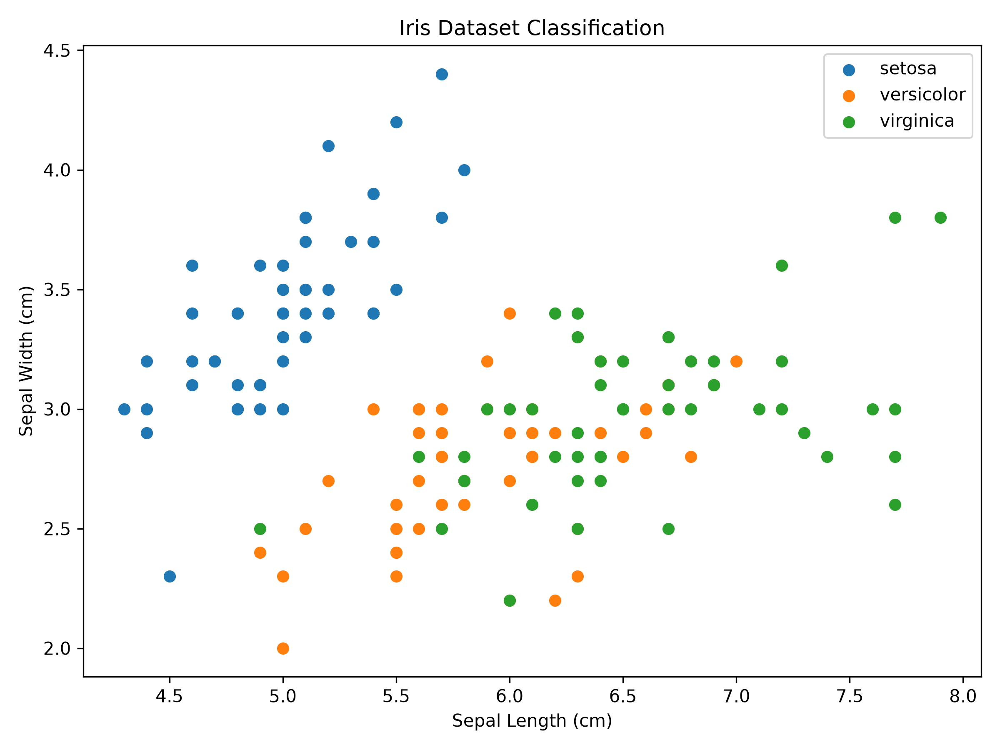

#  Iris Dataset Classification AI

A machine learning-based Iris Flower Classification project developed using **Python, Pandas, Scikit-learn, Matplotlib, and Tkinter**.

This project uses a **Decision Tree Classifier** to classify Iris flowers into three species: **Setosa, Versicolor, and Virginica**.

The project includes both a **machine learning implementation** and a **graphical desktop application (GUI)** that allows users to enter flower measurements and predict the species interactively.

---

##  Project Overview

The Iris Dataset Classification system demonstrates a complete machine learning classification workflow.

The project includes:

- Iris dataset loading
- Dataset exploration
- DataFrame creation using Pandas
- Dataset shape and information
- Class distribution
- Train-test splitting
- Decision Tree model training
- Model prediction
- Accuracy evaluation
- Classification report
- Confusion matrix
- Data visualization
- New flower species prediction
- Graphical desktop application

The desktop application provides a simple interface where users can enter Iris flower measurements and receive a predicted species.

---

##  Project Objectives

The main objectives of this project are:

- To understand and explore the Iris dataset.
- To analyze the dataset using Pandas.
- To divide the dataset into training and testing sets.
- To train a Decision Tree classification model.
- To evaluate the model using accuracy, precision, recall, and F1-score.
- To generate a confusion matrix.
- To visualize the classification results.
- To predict the species of new Iris flower data.
- To provide a user-friendly desktop GUI for the classification system.

---

##  Iris Flower Classes

The Iris dataset contains three flower species:

| Species | Samples |
|---|---:|
| Setosa | 50 |
| Versicolor | 50 |
| Virginica | 50 |

The model uses four features:

- Sepal Length
- Sepal Width
- Petal Length
- Petal Width

---

##  Machine Learning Model

The project uses the **Decision Tree Classifier** from Scikit-learn.

### Model Configuration

```text
Algorithm: Decision Tree Classifier
Test Size: 20%
Training Samples: 120
Testing Samples: 30
Random State: 42
```

The dataset is divided into training and testing data using a stratified train-test split.

---

##  Model Performance

The trained Decision Tree model achieved an accuracy of:

### **93.33%**

### Classification Report

| Class | Precision | Recall | F1-Score | Support |
|---|---:|---:|---:|---:|
| Setosa | 1.00 | 1.00 | 1.00 | 10 |
| Versicolor | 0.90 | 0.90 | 0.90 | 10 |
| Virginica | 0.90 | 0.90 | 0.90 | 10 |

### Confusion Matrix

```text
[[10  0  0]
 [ 0  9  1]
 [ 0  1  9]]
```

The model correctly classified most of the test samples. The confusion matrix shows only two misclassifications between Versicolor and Virginica.

---

#  Desktop Software

The project includes a graphical desktop application developed using **Tkinter**.

The software provides:

- Dataset information
- Dataset shape
- Class information
- Training and testing data size
- Decision Tree model information
- Model accuracy
- New flower prediction
- Classification report
- Confusion matrix
- Classification plot

---

##  Software Screenshots

### Screenshot 1 — Main Application



### Screenshot 2 — Prediction Result



### Screenshot 3 — Classification Report



### Screenshot 4 — Confusion Matrix



---

##  New Flower Prediction

The software allows the user to enter four flower measurements:

```text
Sepal Length
Sepal Width
Petal Length
Petal Width
```

### Example Input

```text
Sepal Length: 5.1
Sepal Width: 3.5
Petal Length: 1.4
Petal Width: 0.2
```

### Prediction

```text
Predicted Species: SETOSA
```

The entered values are passed to the trained Decision Tree model, which predicts the most likely Iris species.

---

#  Project Visualizations

### Confusion Matrix

The confusion matrix shows the relationship between the actual and predicted classes.



### Classification Plot

The classification plot visualizes the Iris dataset based on sepal measurements.



---

#  Technologies Used

- **Python 3**
- **Pandas**
- **Scikit-learn**
- **Matplotlib**
- **Tkinter**

---

#  Libraries Used

The project uses the following Python libraries:

```text
pandas
scikit-learn
matplotlib
tkinter
```

Tkinter is included with standard Python installations on Windows.

---

#  Project Structure

```text
Data-Classification-AI/
│
├── main.py
├── app.py
├── confusion_matrix.png
├── classification_plot.png
├── Screenshots/
│   ├── screenshot1.jpg
│   ├── screenshot2.jpg
│   ├── screenshot3.jpg
│   └── screenshot4.jpg
├── README.md
└── requirements.txt
```

### File Description

| File/Folder | Description |
|---|---|
| `main.py` | Main machine learning implementation |
| `app.py` | Graphical desktop application |
| `confusion_matrix.png` | Confusion matrix visualization |
| `classification_plot.png` | Iris classification visualization |
| `Screenshots/` | Project and software screenshots |
| `screenshot1.jpg` | Main application screenshot |
| `screenshot2.jpg` | Prediction result screenshot |
| `screenshot3.jpg` | Classification report screenshot |
| `screenshot4.jpg` | Visualization screenshot |
| `README.md` | Project documentation |
| `requirements.txt` | Required Python libraries |

---

#  Installation and Setup

## 1. Install Python

Make sure Python 3 is installed on your computer.

Check the Python version:

```bash
python --version
```

Example:

```text
Python 3.11.x
```

---

## 2. Open the Project

Open the project folder in **Visual Studio Code**:

```text
Data-Classification-AI
```

---

## 3. Open the Terminal

In Visual Studio Code, open:

```text
Terminal → New Terminal
```

Make sure the terminal is inside the project folder.

Example:

```powershell
PS C:\Users\Simco\Desktop\Data-Classification-AI>
```

If the terminal is not inside the project folder, use:

```powershell
cd "C:\Users\Simco\Desktop\Data-Classification-AI"
```

---

## 4. Install Required Libraries

Run:

```bash
pip install pandas scikit-learn matplotlib
```

If the above command does not work, use:

```bash
python -m pip install pandas scikit-learn matplotlib
```

---

#  How to Run the Desktop Software

The graphical application is located in:

```text
app.py
```

To start the software, open the terminal inside the project folder and run:

```bash
python app.py
```

After pressing Enter, the **Iris Dataset Classification** software window will open.

---

#  How to Use the Software

## Step 1 — Enter Flower Measurements

Enter values for:

```text
Sepal Length
Sepal Width
Petal Length
Petal Width
```

## Step 2 — Predict Species

Click the:

```text
Predict Species
```

button.

The software will display the predicted Iris species.

## Step 3 — View Classification Report

Click:

```text
Classification Report
```

This displays:

- Precision
- Recall
- F1-score
- Support
- Accuracy

## Step 4 — View Confusion Matrix

Click:

```text
Confusion Matrix
```

A graphical confusion matrix will be displayed.

## Step 5 — View Classification Plot

Click:

```text
Classification Plot
```

A scatter plot of the Iris dataset will be displayed.

---

#  How to Run the Original Python Program

The original machine learning implementation is available in:

```text
main.py
```

To run it:

```bash
python main.py
```

The program displays:

- Dataset loaded successfully
- First five rows
- Dataset shape
- Dataset information
- Class distribution
- Training data size
- Testing data size
- Model accuracy
- Classification report
- Confusion matrix
- New data prediction

The program also generates:

```text
confusion_matrix.png
classification_plot.png
```

---

#  Machine Learning Workflow

```text
Iris Dataset
     ↓
Data Loading
     ↓
DataFrame Creation
     ↓
Dataset Exploration
     ↓
Class Distribution
     ↓
Train-Test Split
     ↓
Decision Tree Classifier
     ↓
Model Training
     ↓
Prediction
     ↓
Model Evaluation
     ↓
Accuracy & Classification Report
     ↓
Confusion Matrix
     ↓
Visualization
     ↓
New Flower Prediction
```

---

#  Dataset Information

The project uses the built-in **Iris dataset** provided by Scikit-learn.

### Dataset Details

```text
Total Samples: 150
Features: 4
Classes: 3
```

### Features

```text
1. Sepal Length
2. Sepal Width
3. Petal Length
4. Petal Width
```

Each Iris species contains 50 samples.

---

#  Results Summary

| Metric | Result |
|---|---|
| Dataset Samples | 150 |
| Number of Classes | 3 |
| Training Samples | 120 |
| Testing Samples | 30 |
| Classification Algorithm | Decision Tree |
| Model Accuracy | 93.33% |
| Example Prediction | Setosa |

---

#  Key Features

- ✅ Iris dataset classification
- ✅ Decision Tree machine learning model
- ✅ 93.33% model accuracy
- ✅ Train-test split
- ✅ Classification report
- ✅ Confusion matrix
- ✅ Data visualization
- ✅ New flower prediction
- ✅ User-friendly desktop GUI
- ✅ Input validation
- ✅ Original Python implementation
- ✅ Interactive prediction software
- ✅ Project screenshots

---

#  Future Improvements

Possible future improvements include:

- Adding more machine learning algorithms
- Comparing different classification models
- Adding feature importance visualization
- Improving the graphical user interface
- Adding prediction history
- Saving prediction results
- Exporting reports
- Creating a standalone Windows `.exe` application

---

#  Project Purpose

This project was developed as a practical **Machine Learning and Data Classification** project.

It demonstrates how a machine learning model can be trained using the Iris dataset and used to classify flowers based on their physical measurements.

The project combines:

**Data Analysis + Machine Learning + Model Evaluation + Visualization + Desktop GUI**

---

#  Author

**Aima Sadeer**

BS Software Engineering

---

#  License

This project is created for educational and learning purposes.
